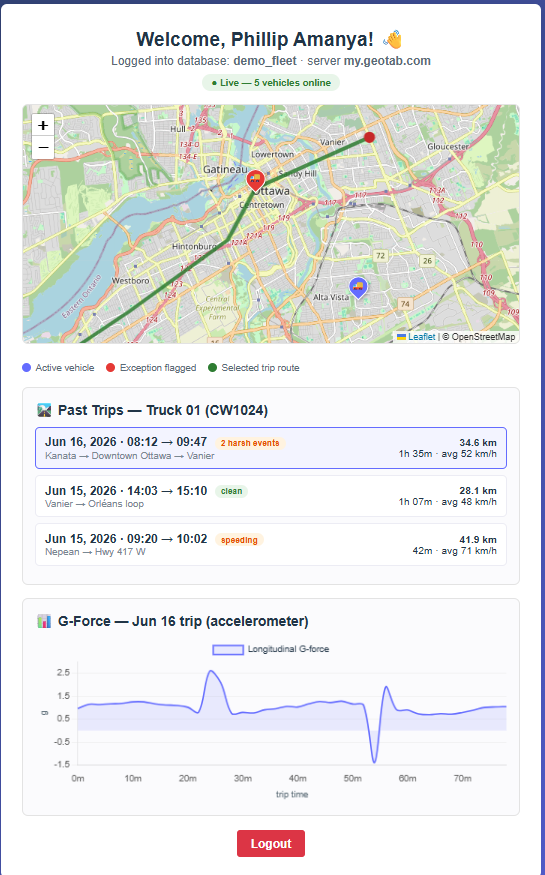

<div align="center">

# 🛰️ Geotab Tracker

### Real-time fleet visibility — live vehicle locations, trip history & exception alerts on an interactive map

[](https://amanyaphillip.github.io/geotab-tracker/)
[](./LICENSE)
[](https://github.com/AmanyaPhillip/geotab-tracker/pulls)

<br/>


</div>

---

## 📖 Overview

**Geotab Tracker** turns raw [Geotab](https://www.geotab.com/) telematics data into a clean, interactive dashboard. Pull live positions for your whole fleet, replay where a vehicle has been, and surface driving exceptions — all in the browser, no install required.

Built as a modern single-page app with **React 19** and **Vite**, with maps powered by **Leaflet** and analytics by **Recharts**.

> 🔗 **Try it live:** [amanyaphillip.github.io/geotab-tracker](https://amanyaphillip.github.io/geotab-tracker/)

---

## 📸 Preview

<div align="center">



<sub>Dashboard view: live vehicle map, past-trip history, and per-trip G-force analytics.</sub>

</div>

---

## ✨ Features

| | Feature | What it does |
|---|---|---|
| 📍 | **Real-time tracking** | Live vehicle positions plotted on an interactive Leaflet map |
| 🛣️ | **Trip history** | Replay a vehicle's route to see exactly where it has been |
| ⚠️ | **Exception reporting** | Alerts for harsh braking, speeding, and after-hours usage |
| 📊 | **Analytics dashboard** | Trends and breakdowns visualized with Recharts |
| 📱 | **Responsive design** | Works on desktop, tablet, and mobile |

---

## 🛠️ Tech Stack

<div align="center">

| Layer | Technology |
|---|---|
| **Framework** | React 19 + Vite 7 |
| **Mapping** | Leaflet · React-Leaflet |
| **Charts** | Recharts |
| **HTTP / Data** | Axios → Geotab API |
| **Tooling** | ESLint, gh-pages |

</div>

---

## 🏗️ How It Works

```
┌──────────────┐      Axios       ┌──────────────┐     React state    ┌──────────────┐
│  Geotab API  │ ───────────────▶ │   Data layer │ ─────────────────▶ │   React UI   │
│  (telematics)│   auth + fetch   │  (transform) │   live + history   │ Map · Charts │
└──────────────┘                  └──────────────┘                    └──────────────┘
```

The app authenticates against the Geotab API, fetches device + trip + exception data, normalizes it, and feeds it into the map (Leaflet) and analytics (Recharts) views.

---

## 🚀 Getting Started

### Prerequisites

- [Node.js](https://nodejs.org/) 18+ and npm
- A **Geotab** account with API access

### Installation

```bash
# 1. Clone the repo
git clone https://github.com/AmanyaPhillip/geotab-tracker.git
cd geotab-tracker

# 2. Install dependencies
npm install

# 3. Add your Geotab credentials (see below)

# 4. Start the dev server
npm run dev
```

The app runs at **http://localhost:5173** by default.

### Environment configuration

Create a `.env` file in the project root. Vite only exposes variables prefixed with `VITE_` to the client:

```env
VITE_GEOTAB_SERVER=my.geotab.com
VITE_GEOTAB_DATABASE=your_database
VITE_GEOTAB_USER=your_username
VITE_GEOTAB_PASSWORD=your_password
```

> ⚠️ **Security note:** This is a client-side app, so any credentials bundled at build time are visible to anyone who loads the page. For anything beyond personal/demo use, proxy Geotab requests through a small backend (or serverless function) and keep secrets server-side.

---

## 📜 Available Scripts

| Command | Description |
|---|---|
| `npm run dev` | Start the Vite dev server |
| `npm run build` | Production build to `dist/` |
| `npm run preview` | Preview the production build locally |
| `npm run lint` | Run ESLint |
| `npm run deploy` | Build and publish to GitHub Pages |

---

## 🌐 Deployment

The project deploys to **GitHub Pages** via the `gh-pages` package:

```bash
npm run deploy
```

The Vite `base` is set to `/geotab-tracker/` so asset paths resolve correctly on Pages. Live build: **[amanyaphillip.github.io/geotab-tracker](https://amanyaphillip.github.io/geotab-tracker/)**

---

## 🗺️ Roadmap

- [ ] Geofencing & zone-based alerts
- [ ] Driver scorecards from exception data
- [ ] Export reports (CSV / PDF)
- [ ] Backend proxy for secure credential handling
- [ ] Dark mode 🌙

---

## 🤝 Contributing

Contributions, issues, and feature requests are welcome! Feel free to open an [issue](https://github.com/AmanyaPhillip/geotab-tracker/issues) or submit a PR.

1. Fork the project
2. Create your feature branch (`git checkout -b feature/amazing-feature`)
3. Commit your changes (`git commit -m 'Add amazing feature'`)
4. Push to the branch (`git push origin feature/amazing-feature`)
5. Open a Pull Request

---

## 📄 License

Distributed under the **GPL-3.0** License. See [`LICENSE`](./LICENSE) for details.

---

## 👤 Author

**Phillip Amanya**

[](https://amanyaphillip.github.io/ViteResumePage/)
[](https://www.linkedin.com/in/phillip-amanya/)
[](https://github.com/AmanyaPhillip)

<div align="center">

⭐ If you find this project useful, consider giving it a star!

</div>
